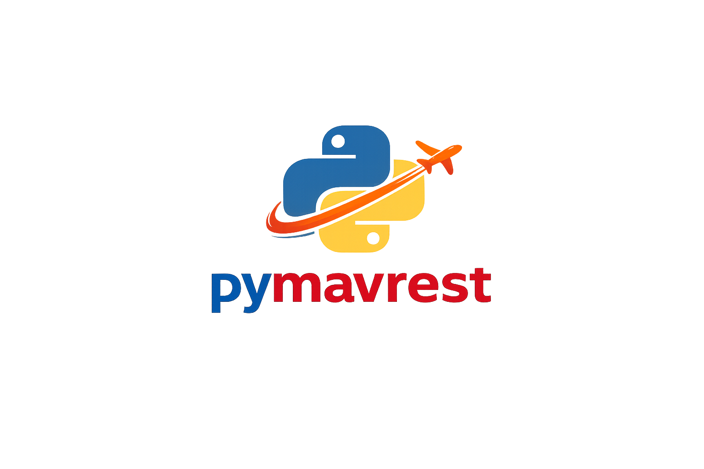

# pymavrest

`pymavrest` is a high-performance REST server for MAVLink-based drones 🚁.
It lets you read telemetry over HTTP and send flight commands over HTTP.

It is a Python alternative to `mavlink2rest` with a strong async architecture 🛰️:
https://github.com/mavlink/mavlink2rest

## Project strengths ✨

- Fully async and high performance ⚡.
- Supports VTOL, multirotor, and other MAVLink-capable vehicles 🚁.
- Compatible with PX4, ArduPilot, and other MAVLink firmwares 🛩️.
- Read telemetry data via HTTP and send drone commands via HTTP 🌐.
- Built-in auth and multi-user access control (JWT + user permissions) 🔐.
- Uses `pymavlink` and `mavsdk` backends and can switch automatically when needed 🔄.
- Highly configurable via `config.json` ⚙️.
- Easy one-command install on mini-computers like Raspberry Pi 🖥️.

## Production prerequisite 🛫

For production deployments, install and configure `mavlink-router`:

https://github.com/mavlink-router/mavlink-router

## Data flow and API example 📡

Architecture:

`Drone 🚁 <-> mavlink-router 📡 <-> pymavrest 🛰️ <-> REST Clients 🌐`

Example request (`flight_details`):

```bash
curl http://localhost:8080/api/v1/messages/flight_details \
  -H "Authorization: Bearer <token>"
```

Returns aggregated telemetry including:

- flight mode 🧭
- battery state 🔋
- GPS position 📍
- speed and attitude 🏎️
- RC status 🎮
- EKF status 📈
- connection flags 🔗
- mission summary 🗺️

Note: use the port configured in `config.json` (`rest_api.port`). The default in this project is `10821`.

OpenAPI docs are available at 📘:

`http://127.0.0.1:10821/docs`

The port may differ depending on your `config.json` (`rest_api.port`).

## Install (one command) ⚙️

Run installer directly with `curl`:

```bash
curl -fsSL https://raw.githubusercontent.com/hadif1999/pymavrest/master/scripts/install.sh | bash -s -- --prod true --backend pymavlink
```

This installs dependencies, syncs the repo into `~/app` by default, and in production mode deploys/runs `pymavrest.service`.

## Installer arguments 🧩

`scripts/install.sh` supports:

- `--branch <name>`: Git branch to clone/pull. Default: `master`
- `--app-dir <path>`: Install/update directory. Default: `$HOME/app`
- `--prod <true|false>`:
  - `true`: deploy and run with `systemd`
  - `false`: install only (do not start app)
  - Default: `true`
- `--backend <pymavlink|mavsdk>`: Backend passed to runtime. Default: `pymavlink`
- `-h`, `--help`: show full help

Help example:

```bash
curl -fsSL https://raw.githubusercontent.com/hadif1999/pymavrest/master/scripts/install.sh | bash -s -- --help
```

## Configure `config.json` (important for production) 🛠️

Before production use, edit your `config.json` values for your environment.
At minimum, update drone connection, auth secrets/users, server endpoints, and networking.

If running as a service, restart after config changes:

```bash
sudo systemctl restart pymavrest
```

## `config.json` parameters 📘

See `README_config.md` for full details. Main sections:

- `general`
  - `log_level`: logging level (`DEBUG`, `INFO`, ...)
  - `is_production`: production behavior flag
- `drone.properties`
  - `URI`: MAVLink source (example: `tcp://127.0.0.1:14550`)
  - `FLIGHT_MODES`: mode code mapping
  - `battery_cap_mah`: battery capacity metadata
  - `serial_number`: optional drone identifier
- `external_devices`
  - Device configs such as `gps` and `sms` (`type`, `COM`, `baud`, `enabled`)
- `requests`
  - `ping_check_by_host`, `timeout`, `retries`
- `rest_api`
  - `port`, `host`, `global_prefix`, `global_timeout`
  - `as_https`, `ssl_keyfile_dir`, `ssl_certfile_dir`
- `auth`
  - `enabled`, `jwt_secret`, `jwt_token_expire_minutes`, `jwt_algorithm`
  - `users[]` with `username`, `password`, `permission`, `active`, `is_admin`
- `health_check`
  - `enabled`, `push_to_server`, `send_sms_in_fail`
  - `route`, `flight_info_route`, `update_interval_sec`
- `server`
  - `base_url`
  - `auth`: `username`, `password`, `route`, `type`
- `sms`
  - `recipient`

## Run manually (test or production) ▶️

You can run directly with `uv run main.py` for testing or production-like manual operation:

```bash
cd ~/app
uv run -p 3.12 main.py -c config.json --backend pymavlink
```

Or with `mavsdk`:

```bash
uv run -p 3.12 main.py -c config.json --backend mavsdk
```

For long-running production systems, prefer `systemd` mode (`--prod true`) so service restarts are managed automatically.
